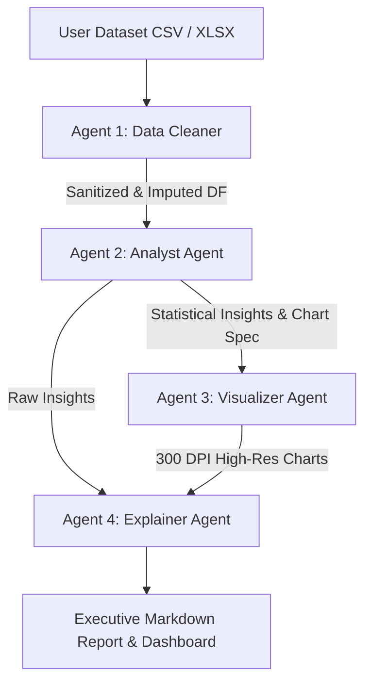

# 🚀 Queryon.ai | Multi-Agent Autonomous Data Intelligence

<p align="center">
  
  
  
  
</p>

---

## 🌟 Overview

**Queryon.ai** is an enterprise-grade autonomous data analyst platform powered by a 4-agent sequential AI engine. Designed for founders, executives, data scientists, and business analysts, **Queryon.ai** transforms raw CSV and Excel spreadsheets into decision-ready executive reports complete with **300 DPI high-definition neon visualizations** in under 30 seconds.

Unlike single-prompt LLM wrappers that hallucinate metrics and break on messy datasets, **Queryon.ai** enforces a strict separation of concerns between deterministic Python execution engines and LLM-driven business reasoning.

---

## 💎 Key Features

- 🧹 **Automated Data Cleaning**: Detects header formatting, converts to `snake_case`, imputes missing numerical values via median and categorical values via mode, and flags IQR outliers.
- 🔒 **Security Hardened**: Built-in CSV formula injection protection (stripping `=`, `+`, `-`, `@`, `\t`, `\r`), path-traversal filename sanitization, and MIME-type verification.
- 📊 **300 DPI Publication-Quality Visualizations**: Generates electric cyan, violet, and hot pink high-definition bar charts, gradient area plots, scatter plots, and donut charts.
- ⚡ **Groq Llama 3 70B Intelligence**: Rapid statistical correlation analysis and executive synthesis with zero metric hallucinations.
- 🎨 **Glassmorphism 3.0 UI**: Ultra-sleek Apple Obsidian Dark aesthetic built with Next.js 15, Tailwind CSS, ambient floating gradient mesh orbs, and metallic glass cards.
- 🚀 **Zero Sign-In Friction**: Open workspace access for instant dataset uploads and analysis.

---

## 🧠 4-Agent Autonomous Pipeline Architecture



### 1. 🧹 Data Cleaner Agent (`cleaner.py`)
- Standardizes column headers into clean `snake_case` identifiers.
- Imputes missing numerical values with column medians and categorical values with modes.
- Strips dangerous formula injection prefixes from string cells.
- Performs IQR-based outlier detection (`Q1 - 1.5*IQR`, `Q3 + 1.5*IQR`).

### 2. 🔍 Analyst Agent (`analyst.py`)
- Calculates Pearson correlation matrices for numerical columns ($|r| > 0.5$).
- Mines top category aggregations and computes linear trend slopes for time-series columns.
- Leverages **Groq Llama 3 70B** to generate structured business findings.

### 3. 🎨 Visualizer Agent (`visualizer.py`)
- Generates 300 DPI high-resolution figures using Matplotlib with a dark cyber-neon palette (`#00f0ff`, `#c084fc`, `#ff007f`).
- Outputs translucent gradient area fills, minimal axis spines, value labels, and center donuts.

### 4. 📝 Explainer Agent (`explainer.py`)
- Synthesizes analytical evidence into structured executive Markdown reports.
- Structure: **Overview → Key Insights with Embedded Graphics → Executive CEO Takeaways**.

---

## 🛠️ Technology Stack

### Frontend
- **Framework**: Next.js 15 (App Router)
- **Styling**: Vanilla CSS3 + Glassmorphism 3.0 tokens + Tailwind CSS
- **Icons**: Lucide React + Inline SVG Vectors
- **Fonts**: Outfit & Plus Jakarta Sans

### Backend
- **Framework**: FastAPI (Python 3.12)
- **Data Engine**: Pandas & NumPy
- **Graphics Engine**: Matplotlib (Agg backend)
- **LLM Engine**: Groq SDK (`llama-3.3-70b-versatile`)
- **Database**: PostgreSQL (Supabase) / SQLite (Dev mode) with SQLAlchemy 2.0 async engine & Alembic migrations

---

## 🚀 Quick Start

### 1. Prerequisites
- Python 3.10+
- Node.js 18+
- Groq API Key (Optional, fallback rule-based engine included)

### 2. Backend Setup
```bash
cd backend
python -m venv .venv
source .venv/bin/activate  # On Windows: .venv\Scripts\activate
pip install -r requirements.txt
python -m uvicorn app.main:app --host 0.0.0.0 --port 8000 --reload
```

### 3. Frontend Setup
```bash
cd frontend
npm install
npm run dev
```

Visit **`http://localhost:3000`** in your browser!

---

## 👨‍💻 Creator & Maintainer

**Abhishek Chandra**  
*Full-Stack & Autonomous AI Systems Engineer*

- **LinkedIn**: [linkedin.com/in/abhishekchandra-sde](https://www.linkedin.com/in/abhishekchandra-sde)
- **GitHub**: [github.com/ABHI3450](https://www.github.com/ABHI3450)
- **Email**: `abhishek.chandra.dev1@gmail.com`

---

## 📜 License

Distributed under the MIT License. See `LICENSE` for details.
